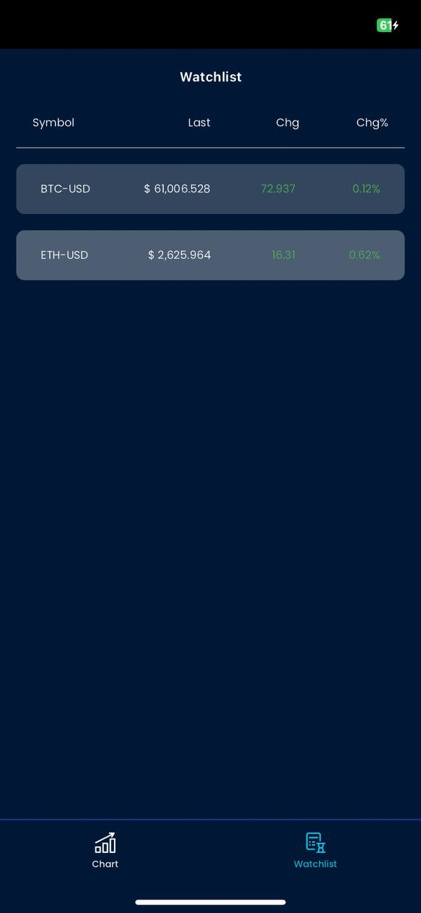

# test_market_websocket

## Using GetX in Flutter

This project is a Flutter application that utilizes the GetX package for state management and navigation.

### Getting Started

To get started with this project, follow these steps:

1. Clone the repository: `git clone https://github.com/saputross/test_market_websocket.git`
2. Navigate to the project directory: `cd your-repo`
3. Install the dependencies: `flutter pub get`
4. Run the app: `flutter run`

### Requirement
- flutter version : 3.19.3
- sdk : >=3.4.4 <4.0.0

### Libraries
- `get_x`: State Management
- `web_socket_channel`: Connection with Websocket
- `fl_chart`: Display chart market
- `intl`: Internationalization 

### Features

This app includes the following features:

- State management using GetX
- Display chart market
- Watchlist market 

### Resources

To learn more about GetX and how to use it in your Flutter projects, refer to the following resources:

- [GetX Documentation](https://pub.dev/packages/get)
- [GetX GitHub Repository](https://github.com/jonataslaw/getx)

